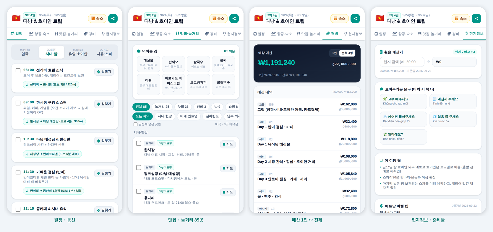

# trip-guide (v0.4)

MD 파일 하나로 **어느 나라든** 해외여행 가이드 웹페이지를 만드는 도구.



<sub>예시: 2026년 9월 다낭·호이안 3박 4일 4인 여행 ([MD 원본](trips/danang-2026.md)) — 일정·동선 / 맛집·놀거리 / 1인↔전체 예산 / 현지정보·준비물. 그 외 샘플: [오사카 2박 3일](trips/sample-osaka.md)(국가 팩 없이)</sub>

**쓰는 사람은 이것만 하면 된다**
1. 맨 위에 제목·나라·날짜·인원 4줄
2. 일정은 `- 09:00 한시장 | 설명 | 구글맵 링크`
3. 장소는 구글맵 [공유] → 링크 붙여넣기 (주소·좌표 불필요)
4. 예산은 `58만 | 1인`, `300만 | 전체` → 화면에서 1인/전체 전환

```
① 여행 MD 작성 ──▶ ② 변환기 (md → trip.json, 검증) ──▶ ③ 화면 (template.html + 국가 팩)
   (직접 or AI)
```

**바로 써보기** → **[빌더](https://dukdamn.github.io/trip-guide/builder/)** · [다낭 예시](https://dukdamn.github.io/trip-guide/template.html?trip=trips/danang-2026.json)

빌더에서: 불러오기(빈 틀/예시) → 편집하면 폰 화면 미리보기 → **HTML 다운로드** (카톡으로 보내면 끝)
AI로 초안 받기: 빌더의 **[AI 프롬프트 복사]** → ChatGPT·Gemini·Claude(무료도 가능)에 붙여넣기 → 결과를 빌더에 붙여넣기

## 구조

| 층 | 파일 | 내용 | 바뀌는 단위 |
|---|---|---|---|
| 공통 화면 | `template.html` | 탭, 타임라인, 지도, 1인/전체 예산, 경비 기록, 체크 저장, ko/ja/en | 거의 안 바뀜 |
| 국가 테이블 | `tools/countries.mjs` | 60여 개국 이름(ko/ja/en)·통화 | 고정 |
| 국가 팩 *(선택)* | `packs/<국가코드>.json` | 환율 기본값, 회화, 교통앱, 전압, 긴급번호, 현지 팁 | 있으면 더 풍부 |
| 여행 | `trips/<id>.md` → `.json` | 날짜, 숙소, 일정, 장소, 예산, 준비물 | 여행마다 1개 |

```
trip-guide/
├── index.html              소개 페이지 (GitHub Pages 첫 화면)
├── builder/index.html      브라우저 빌더: 편집 · 검사 · 미리보기 · HTML 다운로드 · 지도 핀 채우기
├── template.html           공통 화면 (데이터 블록이 비어 있으면 ?trip=경로 로 불러옴)
├── dist/                   빌드 결과: 여행별 HTML 파일 하나 (그대로 카톡·호스팅)
├── schema/
│   ├── trip.schema.json    여행 데이터 규격 (AI·MD·화면 사이의 계약)
│   └── pack.schema.json    국가 팩 규격
├── packs/                  (선택) 있으면 회화·현지 팁 추가
│   └── vn.json             베트남 팩
├── trips/
│   ├── danang-2026.md/.json   다낭 4인 (실제 여행)
│   └── sample-osaka.md/.json  오사카 2인 (팩 없이 동작 확인용)
├── templates/
│   └── blank-trip.md       빈 여행 틀
├── docs/
│   ├── md-format.md        MD 작성 규칙
│   ├── ai-prompt.md        AI에게 MD 초안을 받는 프롬프트
│   └── images/             README·블로그용 스크린샷
└── tools/
    ├── build-html.mjs      MD → 완성 HTML 한 파일 (template + trip + pack)
    ├── md2json.mjs         MD → JSON 변환 + 검증 (브라우저에서도 재사용)
    ├── countries.mjs       나라 이름 → 코드·통화
    └── check-packs.mjs     국가 팩 검증
```

## 사용

```bash
npm install
npm run build:danang     # trips/danang-2026.md → dist/danang-2026.html
npm run build:osaka      # 국가 팩 없는 나라 예시
node tools/build-html.mjs trips/<내여행>.md [--resolve]   # --resolve: 짧은 구글맵 링크 → 좌표
node tools/md2json.mjs trips/<내여행>.md -o trips/<내여행>.json   # JSON만
npm run check:packs      # packs/*.json 검증
npm run serve            # http://localhost:8080/builder/ 에서 빌더 실행 (file:// 로는 동작 안 함)
```

호스팅할 때는 빌드 없이도 된다: `template.html?trip=trips/danang-2026.json` (팩은 `packs/<국가>.json`을 자동으로 불러옴)

## 설계 원칙

- **스키마가 먼저.** AI가 만들든 사람이 쓰든 `trip.schema.json`을 통과해야 화면에 들어간다.
- **사람이 쓰는 건 MD, 기계가 읽는 건 JSON.** MD는 한 줄 문법(`| ` 구분 + 접두어)으로 단순하게.
- **어느 나라든.** 나라 이름만 쓰면 통화가 정해지고, 국가 팩은 있으면 더 좋은 선택 사항.
- **입력은 링크로.** 구글맵 링크에서 장소명·좌표를 뽑는다. 좌표가 없는 짧은 링크도 지도 버튼은 동작.
- **예산은 1인/전체 혼합.** 항목마다 기준을 적고, 화면에서 인원수로 환산해 둘 다 보여준다.
- **바뀌는 정보엔 기준일.** 환율(`rate_as_of`), 팩(`asOf`), 입국 규정(`verify: true`)은 화면에 "출발 전 확인"으로 표시.
- **좌표는 선택.** 검색어만 있어도 구글맵 링크는 동작. 좌표가 있으면 일자별 지도에 핀.

## 로드맵

1. ✅ 스키마 + 다낭 예시 + 변환기(CLI)
1.1 ✅ 구글맵 링크 입력, 1인/전체 예산, 국가 팩 선택화, 시간대(오후:) 입력
2. ✅ `template.html` 렌더러 + `build-html` (1인/전체 예산 전환, ko/ja/en, 팩 없는 나라 대응)
3. ✅ 브라우저 빌더 (검사·미리보기·HTML 다운로드·OSM 지도 핀 채우기) + GitHub Pages 배포 워크플로
4. ✅ AI 프롬프트 v1 (`docs/ai-prompt.md`, 좌표는 지어내지 않고 구글맵 검색 링크로)
5. ⬜ 국가 팩 늘리기 (jp, th, tw …)
6. ⬜ 네이버 블로그 시리즈 · 지도 포함 스크린샷 교체

## 라이선스

[MIT](LICENSE)
